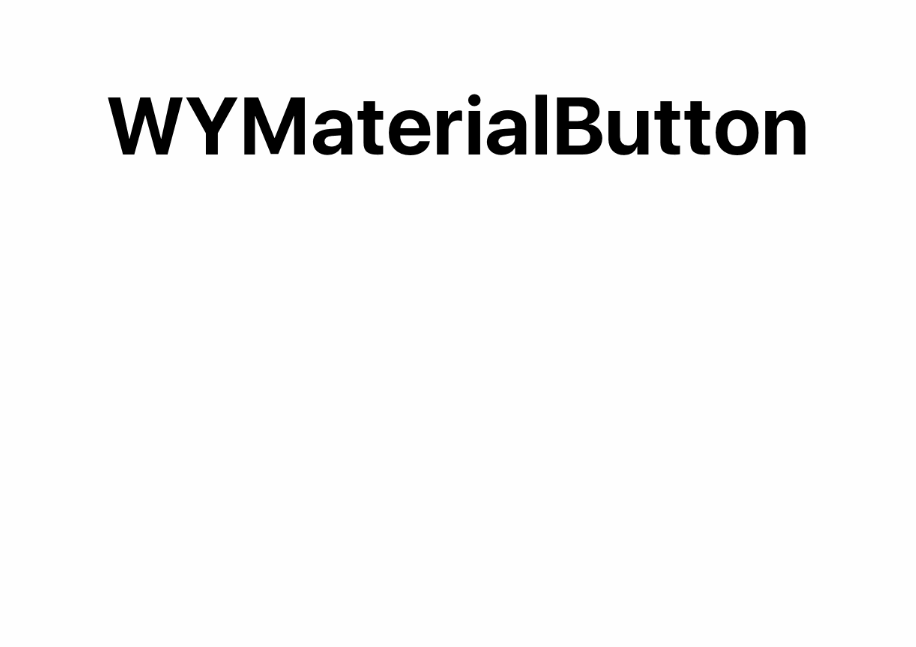
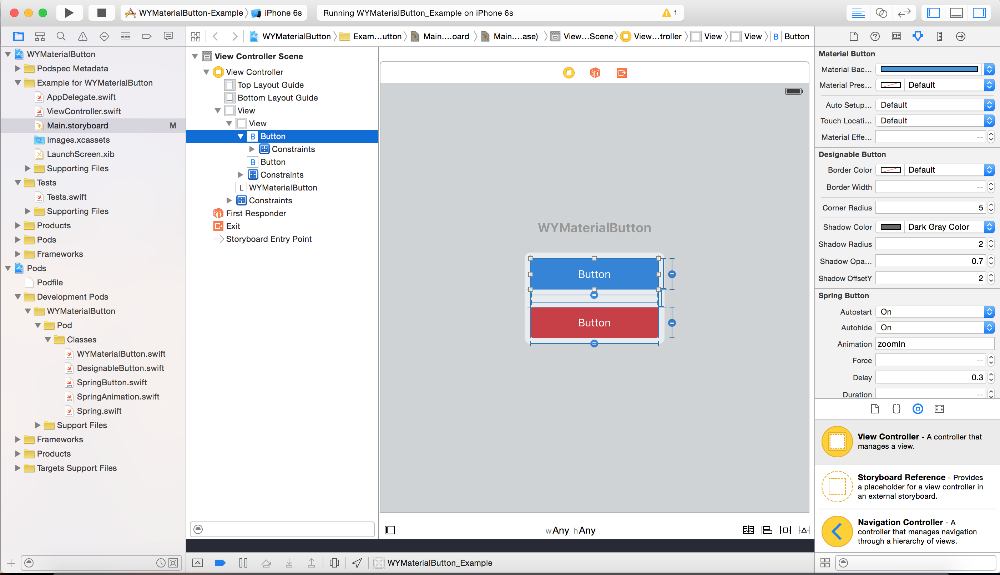

# WYMaterialButton

[](http://cocoapods.org/pods/WYMaterialButton)
[](http://cocoapods.org/pods/WYMaterialButton)
[](http://cocoapods.org/pods/WYMaterialButton)

#### Inspired by Google Material Design, written purely in Swift 3. 

WYMaterialButton implemented Material Design on iOS and add more dynamic motions, allowing iOS buttons to be more responsive and interactive.

Integrated with [Spring](https://github.com/MengTo/Spring) animations and enhanced by Facebook's [POP](https://github.com/facebook/pop), WYMaterialButton is super animated and programmer-friendly. All settings can be customized in storyboard inspector.




## Installation

#### WYMaterialButton is available through [CocoaPods](http://cocoapods.org).

To install via CocoaPods add this lines to your Podfile

```ruby
use_frameworks!
pod "WYMaterialButton"
```
Note: Due to [CocoaPods/CocoaPods#4420 issue](https://github.com/CocoaPods/CocoaPods/issues/4420) there is problem with compiling project with Xcode 7.1 and **CocoaPods v0.39.0**. However there is a temporary workaround for this:
Add next lines to the end of your Podfile
```ruby
post_install do |installer|
    `find Pods -regex 'Pods/pop.*\\.h' -print0 | xargs -0 sed -i '' 's/\\(<\\)pop\\/\\(.*\\)\\(>\\)/\\"\\2\\"/'`
end
```

#### Or download the git repository
```fish
git clone https://github.com/yuwang17/WYMaterialButton.git
```

Drag ``WYMaterialButton`` related files into your own project, and install facebook's [POP](https://github.com/facebook/pop) via cocoapods

Then import the module in your file
```swift
import WYMaterialButton
```

If you're Objective-C user, please include the header file
```swift
#import "WYMaterialButton-Swift.h"
```

## Usage
1) Add a ``UIButton`` in the Storyboard of your project.

2) Subclass the UIbutton as ``WYMaterialButton`` in identity inspector.

3) Select a color as ``Material Color``, the first row in attribute inspector, and let WYMaterialButton do everything else for you. You can also do other setting as well for further customizations.


c
## Specification
* For most cases, ``Material Color`` is the only property you need to set. Leave others as default.

* ``Pulse Enable`` enable defautly, which control the bounce effect.

* With ``Touch Location Enable`` enabled defautly, WYMaterialButton tracks your touch location and generate a ripple animation upon that. You can disable to always center the ripple effect on the button.

* ``Material Effect Percent`` speicifies the percentage of area of the button will have material effect when being pressed. Default to ``0.8``.

* You can of course access all these properties and more by using codes. For example:
  ```swift
  myButton.materialColor = .blue
  ```


## Demo
1) Download the repository
```fish
git clone https://github.com/yuwang17/WYMaterialButton.git
cd WYMaterialButton/Example
```

2) Open the workspace
```fish
open WYMaterialButton.xcworkspace
```

3) Compile and run the app in simulator
* Under Xcode, press ``Ctrl + R``

## Supported OS & SDK Versions
* Xcode 7
* iOS 7

## Credits
[Spring](https://github.com/MengTo/Spring): subclass [@Mengto](https://twitter.com/MengTo)'s Spring framework for supporting additional animations and quick settings in the button.

[POP](https://github.com/facebook/pop): Facebook's animation framework for simulating the bounce effect.

[Material Design](https://www.google.com/design/spec/material-design/introduction.html): animation idea and effects come from Google's material design concept.

## License
WYMaterialButton is available under the [MIT License](LICENSE), see LICENSE for more infomation.
