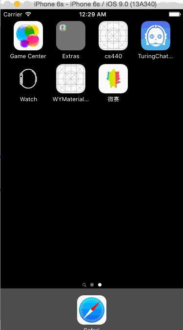

# WYMaterialButton

[](http://cocoapods.org/pods/WYMaterialButton)
[](http://cocoapods.org/pods/WYMaterialButton)
[](http://cocoapods.org/pods/WYMaterialButton)

#### WYMaterialButton written pure in Swift 2, inspired by Google Material Design. 

WYMaterialButton implemented Material Design on iOS, allowing iOS buttons to be more responsive and interactive.

Integraded with Spring animations, WYMaterialButton is super animated and programmer-friendly. All settings support and can be done in storyboard inspector.




## Installation

#### WYMaterialButton is available through [CocoaPods](http://cocoapods.org).

To install it, simply add the following line to your Podfile:

```ruby
pod "WYMaterialButton"
```


#### Or download the git repository
```fish
git clone https://github.com/yuwang17/WYMaterialButton.git
```

Drag ``WYMaterialButton`` related files into your own project

Then import the module in your file
```swift
import WYMaterialButton
```

If you're Objective-C user, please include the header file
```swift
#import "WYMaterialButton-Swift.h"
```

## Usage
1) Add a ``UIButton`` in the Storyboard of your project.

2) Subclass this UIbutton as ``WYMaterialButton`` in identity inspector.


3) Select a color in attribute inspector, and let WYMaterialButton do everything else for you.


## Demo
1) Download the repository
```fish
git clone https://github.com/yuwang17/WYMaterialButton.git
cd WYMaterialButton/Example
```

2) Open the workspace
```fish
open WYMaterialButton.xcworkspace
```

3) Compile and run the app in simulator
* Under Xcode, press ``Ctrl + R``

## Requirements
* Xcode 6
* iOS 7

## LICENSE
WYMaterialButton is available under the [MIT License](LICENSE), see LICENSE for more infomation.
